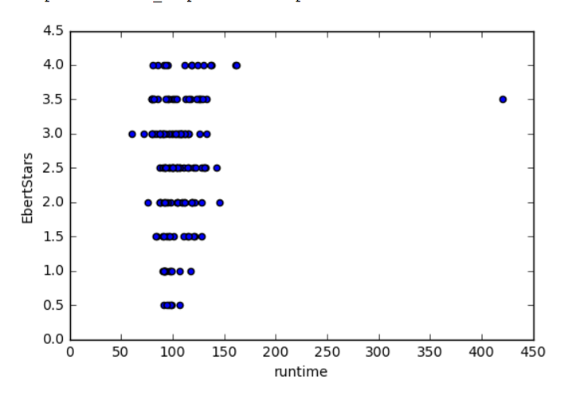
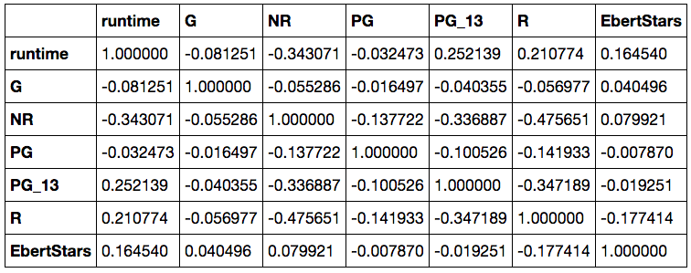
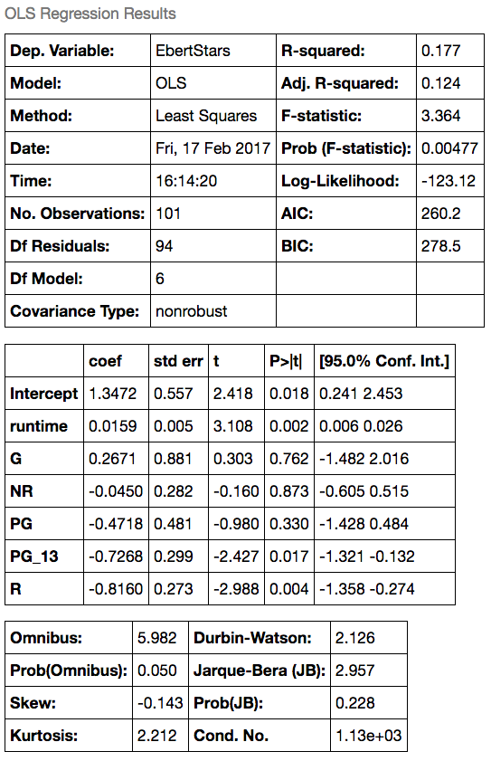

# Regression Project MVP

## Goals

Use web scraping, exploratory data analysis, and linear regression to look at an interesting question related to movie and film.

## Initial Data Cleaning Approach and Exploratory Findings

I scraped recent movie data from the Roger Ebert website. I collected the following features: title, star rating, year released, MPAA rating, runtime in minutes as well as the text content of the movie review.

Some of the values in runtime and MPAA rating were missing. For now, I left in the data and have not choosen a proper imputation strategy.

After cleaning and organizing the data, I examined the distribution of ratings with a histogram.

I also made a scatter plot to see if there might be any trends with runtime.

Good thing I examined the data from various angles. I was able to find an outlier with the runtime. It looks like a short TV series was reviewed, so I removed that before moving to the modeling stage. I also had to perform one-hot encoding on the MPAA rating variables so the linear regression model could probably evaluate those features.

Below is the correlation of the selected features and the response variable. Notice that only runtime and the R rating have a week correlation, everything else would be considered non-existant.

I ran a multiple linear regression model with `statsmodels`. The R-squared value was not high and the p-values inform me that I should probably drop some extraneous variables as I revise my model.

## Intial Findings

1. **Increase Width and Height** - The dataset right now only has runtime and MPAA rating to predict the movie star rating. Also, there were only about 180 samples. We need movie entries and more features to increase predictive power.
2. **Review Analysis** - The textual content of the movie review could add value to the predictive model if I was able to convert it to quantitative features. At this point, I am not versed in how to do that.

## Further Research and Analysis

1. Robust scraping to handle infinity scrolling
2. Bring in IMDB data for genre, actors, directors, countries, other critic ratings
3. Potential feature engineering
4. Store in SQL DB
5. Deeper exploratory analysis and potentially some statistical inference
6. Extensive linear modeling and test significance and assumptions
7. Visualize errors and residuals
