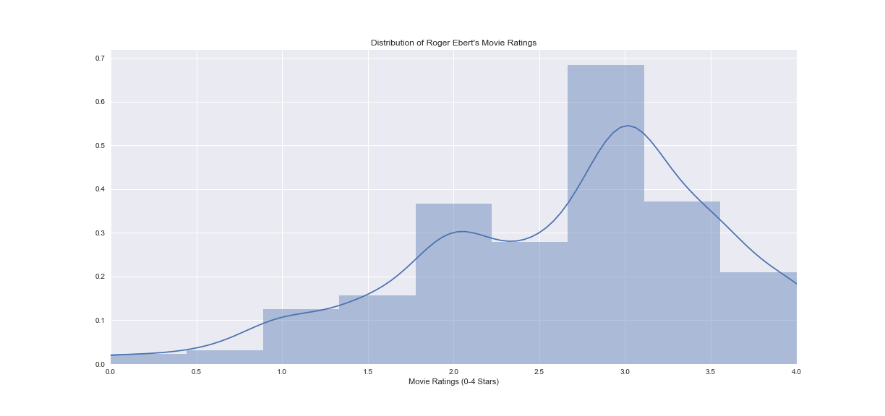
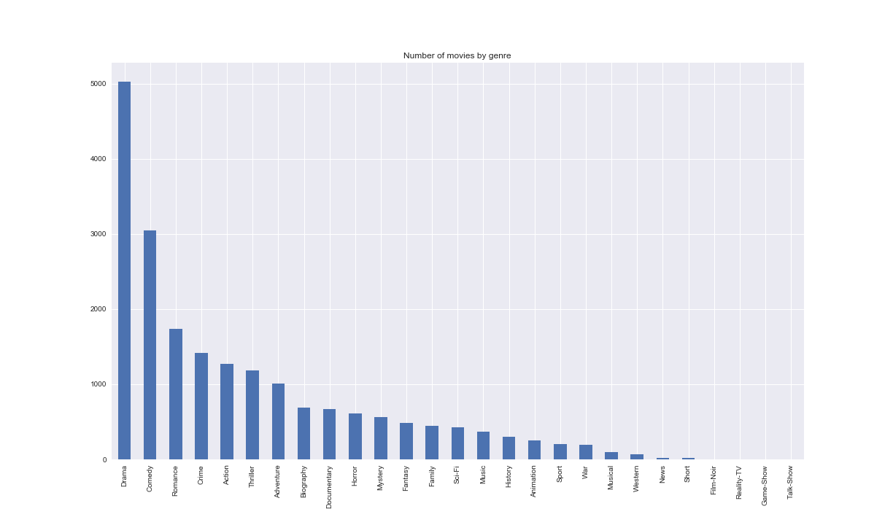
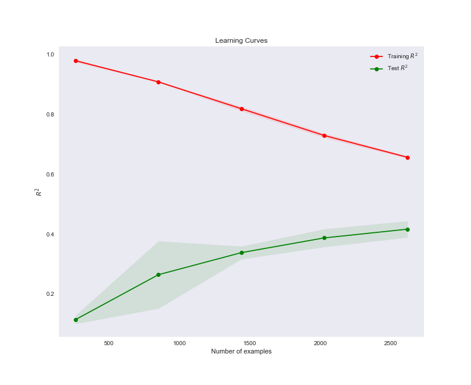

# Movie Regression Project

## Introduction

This is an open-ended Regression project for the Data Science program at [K2 Data Science](http://k2datascience.com). I would like to design a machine learning algorithm to learn how renowned late movie critic Roger Ebert would review movies today.

With the abundance of data on movies, scripts, reviews, and forums for everyone - critics and general audience to express their opinion on movies - can I try to model Ebert's movie ratings against everyone else's?

So I would like to explore the question: **Can we model the movie preferences of the late Roger Ebert and estimate how he would continue to rate movies today?**

## Challenge

Roger Ebert was a unique movie critic. He did not review like other well-known critics, often went against the grain and had a strong penchant for foreign films. My tastes are starkedly different than his. Ebert's understanding of the cinema domain was extensive. He understands the minutae of themes, plots, acting, cinematography, and orchestral composition.

It will probably be inadequate to model based purely on objective data and numerical features. Generating features that have some leaning toward subjectivity could push the model into stronger predictive territory. Examining the ratings from regular movie goers and other critics could have a strong correlation with Ebert's ratings.

Here is what I have found by reading about Ebert's critical style on [Wikipedia](https://en.wikipedia.org/wiki/Roger_Ebert#Critical_style):

- Ebert once said when questioned “I wrote that review 37 years ago. I am not the same person. I am uninterested in being ‘consistent’”
- Ebert emphasized his star ratings had little meaning if not considered in the context of the review itself. He described his critical approach to films as “relative, not absolute”. He reviewed a film for what he felt it would be to its prospective audience.
- “Ebert’s views could clash with the overall reception of movies, as evidenced by (…)”
- Even though Ebert was described as an agnostic in 2005, “Ebert commented on films using his Catholic upbringing as a point of reference, and was critical of films he believed were grossly ignorant of or insulting Catholicism.
- “Ebert was also and advocate of Asian American cinema.”
- Ebert was accused by some horror movie fans of elitism in his dismissal of what he calls “Dead Teenager Movies”, which he felt consisted of nothing more than groups of teenagers being killed off with the exception of one survivor to populate a sequel.
- “His favorite actor was Robert Mitchum and his favorite actress was Ingrid Bergman. He also considered Buster Keaton, Robert Altman, Weber Herzog and Martin Scorsese to be his favorite directors.”
- “Ebert was an outspoken opponent of the MPAA film rating system, repeatedly criticizing its decisions regarding which movies are suitable for children.”

That showed me that adding genres, actors, directors and maybe a decade classification could be very helpful.

## Data

- 9000+ Roger Ebert movie reviews scraped from website over 36 year period (1980-2016)
- Metacritic scores
- IMDB scores and review counts
- Genres, actors and directors

## Exploratory Data Analysis

After cleaning and organizing the data, I examined the distribution of ratings with a histogram.

I also explored various quantitative features against the Ebert Stars to see if there was a high pearson correlation coefficient.

## Feature Engineering

After an inital round of EDA, I went on to engineer novel features from the data set. I thought the following may have some influence on Roger Ebert's ratings:

- Whether a film was foreign (non-english dialogue)
- Ratio of user reviews to critic reviews on IMDB
- Length of movie description on IMDB and review on Ebert's website (in words)
- Season the movie was released in (ie. Winter)

I also created dummy variables for the following data:

- Genres
- Directors
- Star actors
- Decade

However, I discarded actors and directors that appeared in a single movie in the dataset since they wouldn't have much predictive value. Anyhow, that resulted in a high-dimensional dataset with over 4800 features.

## Regression

I started by creating a linear regression model without most of the high-dimensional dummy variables (actors, directors, genres, decades, MPAA ratings). I ran a few different combinations of the remaining features and ended up selecting the one with several of the numeric columns and the dummy variables for Season. The R-squared value was 0.45, meaning that approximately 45% of the variation in Ebert Stars was explained by the input features.

I then chose to use Lasso to help me add all features I had at hand and perform feature subset selection. [Lasso](http://scikit-learn.org/stable/modules/linear_model.html#lasso) (which uses `L1` penalty) is very useful when we have high-dimensional data and a sparse solution like I believed to be the case here. Instead of just reducing the coefficients like Ridge Regression (which uses `L2` penalty) does it actually brings them to zero if the feature is not a good predictor — effectively accomplishing feature subset selection. I also created an algorithm to choose Lasso's hyperparameter `alpha` so that it maximizes `R``2`.

Lasso selected 393 features - about only 8% of the 4801 features I originally fed the algorithm with. In addition to some of the features present in the previous model, it selected a couple of MPAA and decade dummy variables, as well as 7 genres and about 375 stars and directors. However, the `R``2` and Mean Squared Error metrics were only slightly better than the ones from the previous model.

I've identified that the model was underfitting for a couple of reasons. For one, the learning curves showed that more data would be helpful since the training and test curves were a relatively long way to converging.  More importantly, the training `R``2` was low at about 0.59, which showed that even if I added more data my model was still going to be far from a good `R``2` of, let's say, 0.9.

## Lessons Learned

I learned several concepts during this project. I implemented many new packages involved with scraping and explored the nuances of the statsmodels API. I also learned how to use Lasso regression and its feature subset selection to deal with high-dimensional data. Plotting learning curves with Scikit-learn also showed to be very helpful.

## Further Analysis

If I had more time with the project, I would complete the following tasks:
- Try to add more features that could be good predictors, for example:
  - budget
  - box office
  - screenwriter
  - studio
  - awards won by movies/actors/directors
  - whether a movie is part of a series
- Try to get a dataset similar to Metascore but with fewer non-existent values (maybe RottenTomatoes). Dropping many examples from the original dataset because Metascore didn't have data on them made the model underfit even more.
- Build a web app where individuals could put in movie attributes and spit out the projected Ebert rating

## Code Information

Feel free to browse the Jupyter notebooks in this repository. To acquire the data set, follow the docstrings for the scraping functions. I used standard Python packages and visualization libraries. To load the Pickle files you might need to use Pandas version 0.19.x. Pickle files larger than 100mb were not pushed to this repository since GitHub does not support them.
