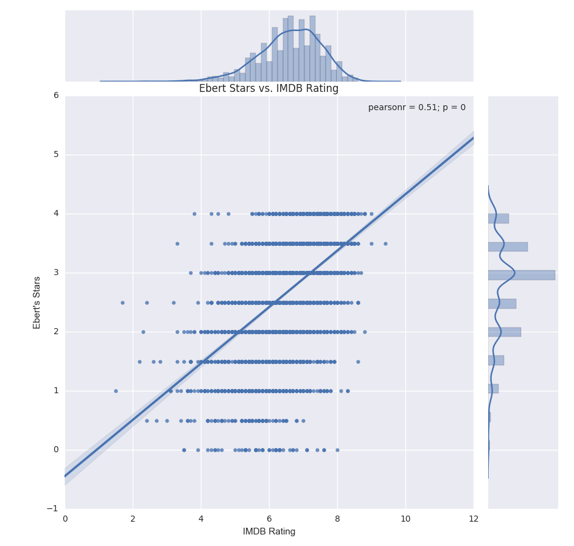
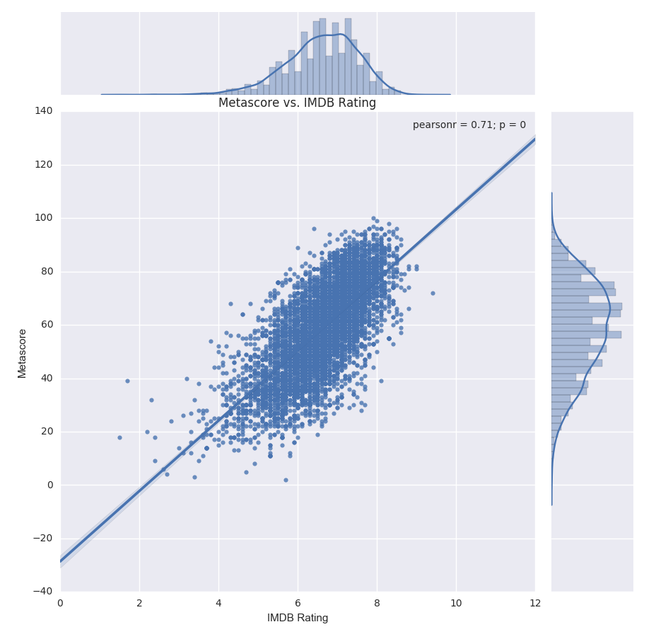
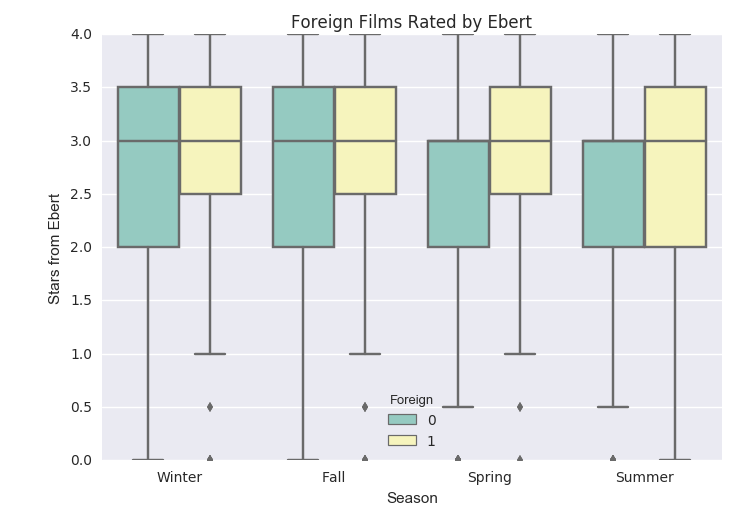
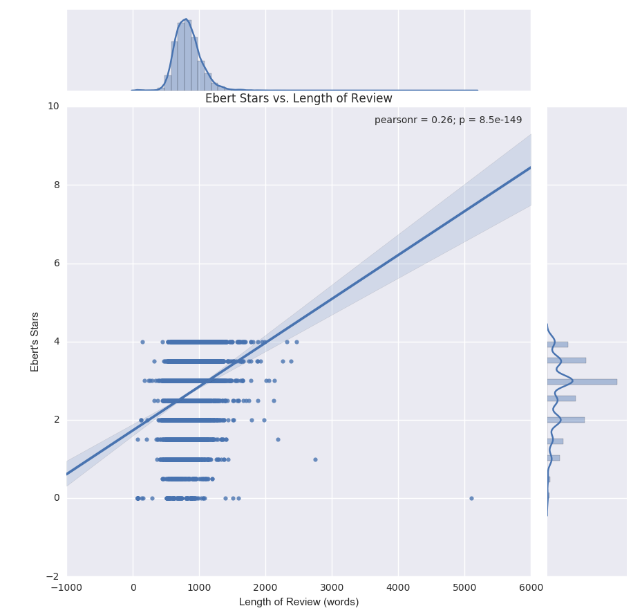
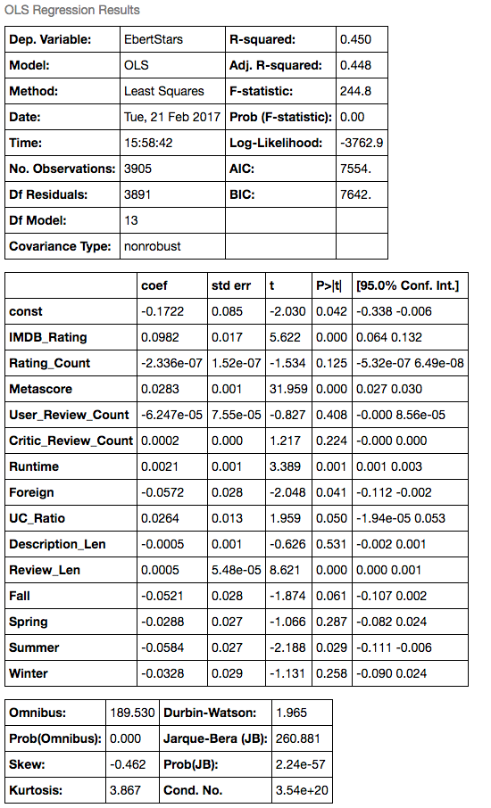
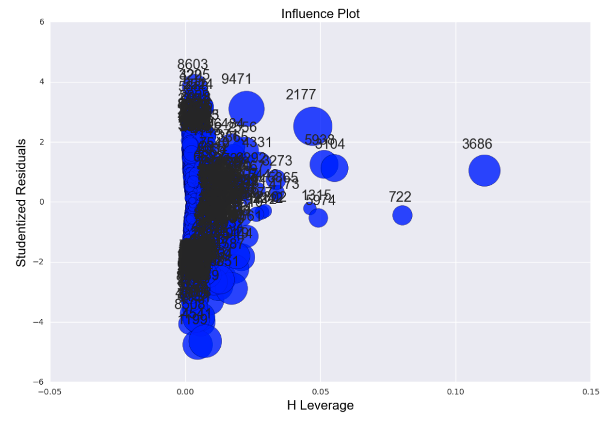
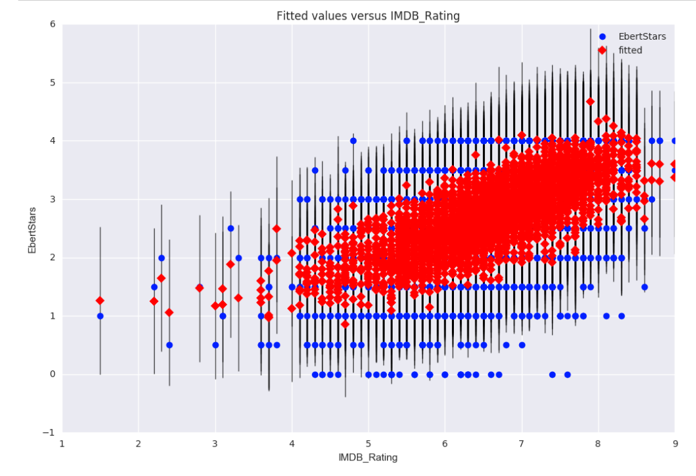

# Movie Regression Project

## Introduction

I would like to design a machine learning algorithm to learn how renowned late movie critic Roger Ebert would review movies today.

With the abundance of data on movies, scripts, reviews, and forums for everyone - critics and general audience to express their opinion on movies - can I try to model Ebert's movie ratings against everyone else's?

So I would like to explore the question: **Can we model the movie preferences of the late Roger Ebert and estimate how he would continue to rate movies today?**

Furthermore, can we create a machine learning algorithm that can not only rate movies similarly, but maybe even analyze movie elements and write reviews as he had?

## Challenge

Roger Ebert was a unique movie critic. He did not review like other well-known critics, often went against the grain and had a strong penchant for foreign films. My tastes are starkedly different than his.

Ebert's understanding of the cinema domain was extensive. He understands the minutae of themes, plots, acting, cinematography, and orchestral composition.

It will probably be inadequate to model based purely on objective data and numerical features. Generating features that have some leaning toward subjectivity could push the model into stronger predictive territory. I believe that examining the ratings from regular movie goers and other critics will have a strong correlation with Ebert's ratings.

## Data

- 9000+ Roger Ebert movie reviews scraped from website over 36 year period (1980-2016)
- Metacritic scores
- IMDB scores and review counts
- Genres, actors and directors

## Exploratory Data Analysis

I explored various quantitative features against the Ebert Stars to see if there was a high pearson correlation coefficient.

## Feature Engineering

After an inital round of EDA, I went on to engineer novel features from the data set. I thought the following may have some influence on Roger Ebert's ratings:

- Whether a film was foreign (non-english dialogue)
- Ratio of user reviews to critic reviews on IMDB
- Length of movie description on IMDB and review on Ebert's website (in words)
- Season the movie was released in (ie. Winter)

## Regression

I ran a few different combinations of features and ended up selecting the one with several of the numeric columns and the dummy variables for Season. The R-squared value was 0.45, meaning that approximately 45% of the variation in Ebert Stars was explained by the input features. I would like to run a more automated process of feature selection and potentially add in dimensionality reduction to my model pipeline.

## Lessons Learned

I learned several concepts during this project. I implemented many new packages involved with scrapy and explored the nuances of the statsmodels API. I did not learn much about the movie industry domain, so if I were to continue working on this project, I would like to do more exploratory data analysis and research Roger Ebert's critiquing process, in hopes to better reverse engineer his process.

## Further Analysis

If I had more time with the project, I would complete the following tasks
- Add in RottenTomatoes numerical attributes
- Examine the effect of Genres and Star Actors
- Fit a simpler multiple regression model on a smaller subset of features
- Build a web app where individuals could put in movie attributes and spit out the projected Ebert rating

## Code Information

Feel free to browse the Jupyter notebooks in this repository. I used standard Python packages and visualization libraries. To acquire the data set, follow the docstrings for the scraping functions.
